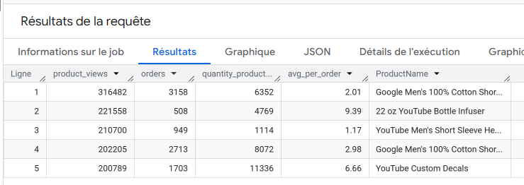
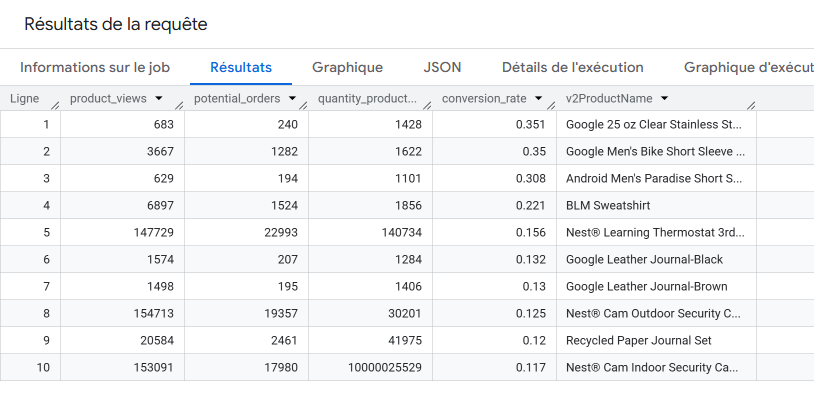

# Lab 01 Results: Exploring an Ecommerce Dataset using SQL in BigQuery

This file summarizes the key findings and observations from some of the queries executed during the lab.

---

## 🔹 Top 5 Most Viewed Products with Average Quantity per Order

**Query:**
```sql
SELECT
  COUNT(*) AS product_views,
  COUNT(productQuantity) AS orders,
  SUM(productQuantity) AS quantity_product_ordered,
  SUM(productQuantity) / COUNT(productQuantity) AS avg_per_order,
  (v2ProductName) AS ProductName
FROM `data-to-insights.ecommerce.all_sessions`
WHERE type = 'PAGE'
GROUP BY v2ProductName
ORDER BY product_views DESC
LIMIT 5;
```
**Results**



---

## Challenge 1: Calculate Product Conversion Rates (Excluding Frisbees)

### Objective

Identify products that had more than 1000 units added to the cart or ordered, excluding any variation of "frisbee" in the name. Calculate a conversion rate based on:

* Potential Orders: Number of times a product was part of an order (complete or incomplete)

* Quantity Added: Total units of product added to cart or ordered

* Conversion Rate: potential_orders / product_views

**Query:**
```sql
SELECT
  COUNT(*) AS product_views,
  COUNT(productQuantity) AS potential_orders,
  SUM(productQuantity) AS quantity_product_added,
  (COUNT(productQuantity) / COUNT(*)) AS conversion_rate,
  v2ProductName
FROM `data-to-insights.ecommerce.all_sessions`
WHERE LOWER(v2ProductName) NOT LIKE '%frisbee%'
GROUP BY v2ProductName
HAVING quantity_product_added > 1000
ORDER BY conversion_rate DESC
LIMIT 10;
```

**Results Summary**




### Some insights 

1. How many distinct times was the product part of an order (either complete or incomplete order)?

Highest value: 22,993 for Nest Learning Thermostat 3rd Gen

2. How many total units of the product were part of orders (either complete or incomplete)?

This corresponds to the column quantity_product_added.
Highest value: 100000025529 for Nest Cam Indoor Security Camera (maybe a data error)

3. Which product had the highest conversion rate?

Highest value: 0.351 for Google 25 oz Clear Stainless Steel Bottle